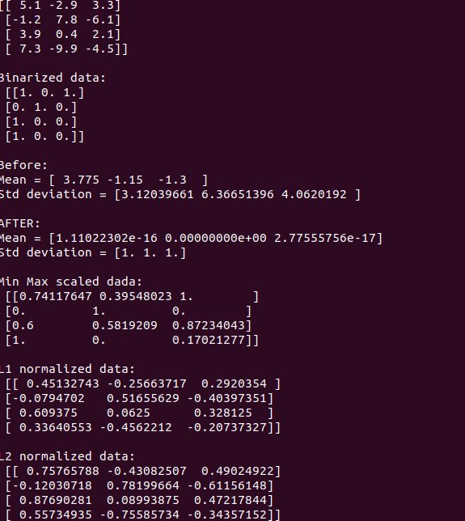
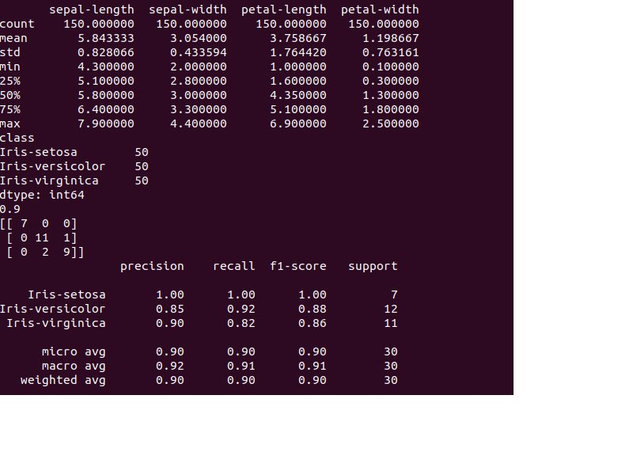
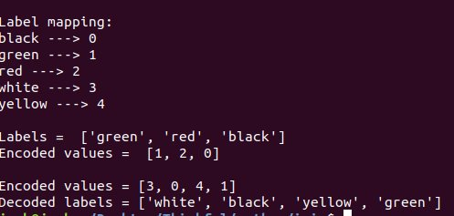
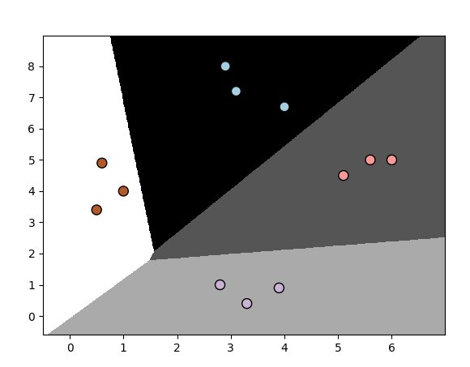
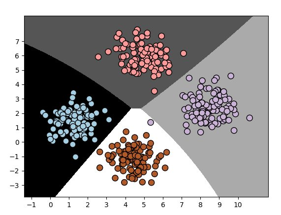
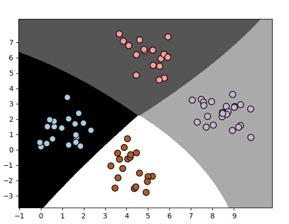
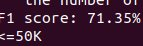

# python-ai

python-ai is a work in understanding how
to create and train ai in a python environment
it has a long way to go but this particular
ai is at a place it can predict income based
on census data.

Original design was a chat bot based on conversational
data from reddit, but was too resource intensive

next idea was to train AI to defeat missle command
however universe has been depricated

## deoendencies

numpy pandas, sklearn, plot

## Contributing

pull requests are welcome and feel free to add to the 
in progress project

## Process to get to income predictor

## data reprocosser

## iris images

## label encoding

## logistic regression

## naive Bayes 1 and 2 pre and post

## snippit output of prediction

